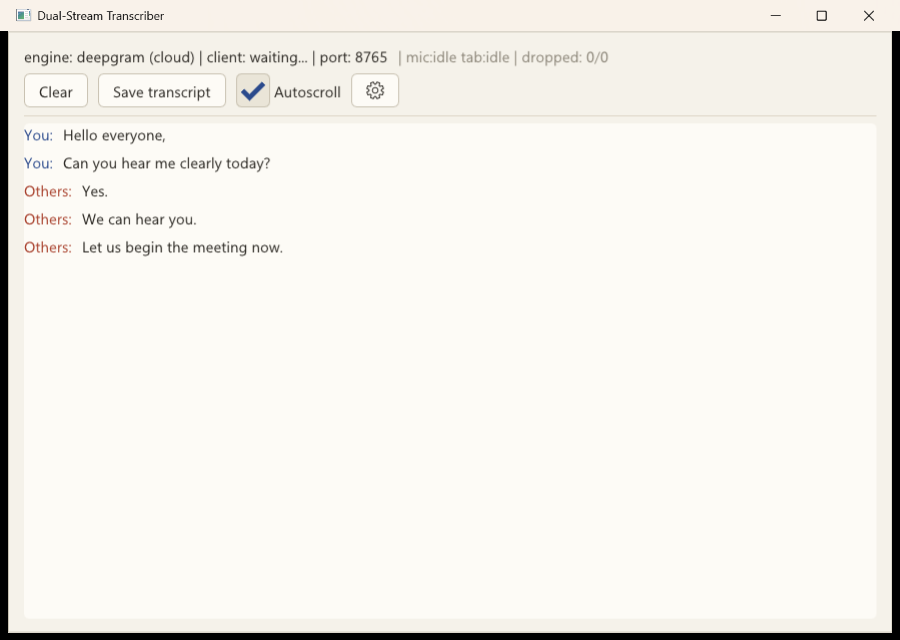
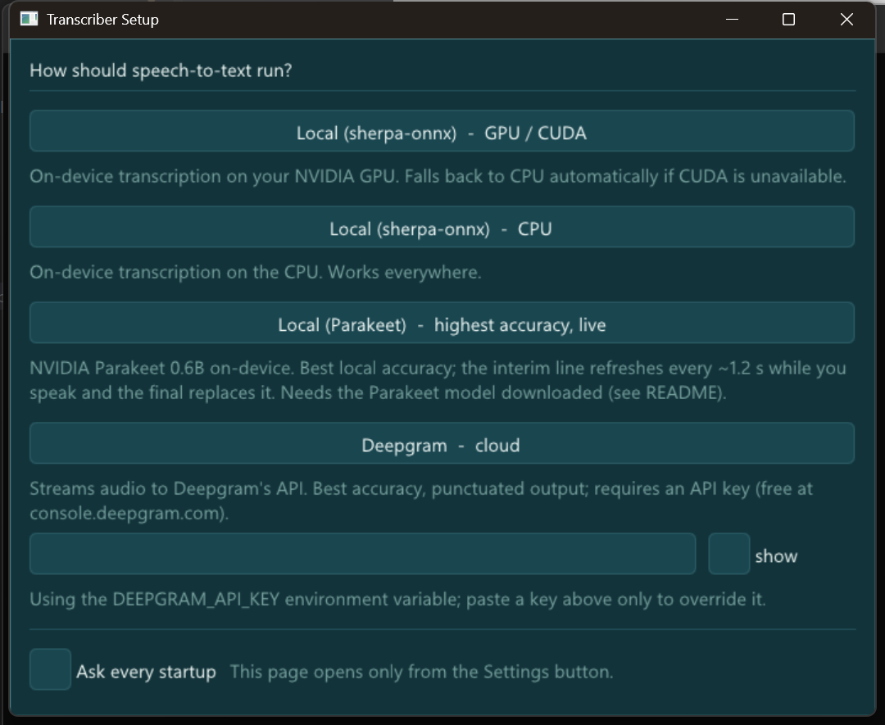

# Dual-Stream Transcription Pipeline

A Chrome extension captures two separate audio streams from a browser tab (e.g. a Google
Meet call) — the local **microphone** and the **tab audio** (remote participants) — and
streams both to a local **C++ desktop app** over a WebSocket. The desktop app transcribes
each stream independently, live, and renders a chronologically merged, two-lane transcript:
aqua **You** (mic) lines and coral **Others** (tab) lines.

Two interchangeable speech engines sit behind one interface: the
[Deepgram](https://deepgram.com) cloud API (the out-of-box default — best accuracy,
punctuated output, needs an API key) and a fully local
[sherpa-onnx](https://github.com/k2-fsa/sherpa-onnx) streaming Zipformer that runs
on-device with no accounts, keys, or network calls at inference time (`--engine sherpa`),
with optional CUDA/TensorRT acceleration (see [GPU acceleration](#gpu-acceleration) and
[Deepgram backend](#deepgram-backend)). An in-app Settings screen switches modes at
runtime and remembers the choice.



## Table of contents

1. [What this is](#dual-stream-transcription-pipeline)
2. [Architecture](#architecture)
3. [Prerequisites](#prerequisites)
4. [Build (desktop)](#build-desktop)
5. [Run](#run)
6. [GPU acceleration](#gpu-acceleration)
7. [Parakeet engine](#parakeet-engine-highest-local-accuracy)
8. [Deepgram backend](#deepgram-backend)
9. [Testing & demo without Chrome](#testing--demo-without-chrome)
10. [Design decisions](#design-decisions)
11. [Troubleshooting](#troubleshooting)

## Architecture

```
┌───────────────────────── Chrome (MV3 extension) ─────────────────────────┐
│ popup (start/stop/status) ── service worker (coordinator)                │
│                                   │ getMediaStreamId + create offscreen  │
│ offscreen document:                                                      │
│   mic:  getUserMedia ──► AudioWorklet (mono, 16 kHz, PCM16) ─┐           │
│   tab:  tabCapture   ──► AudioWorklet (same) ── speakers ────┤           │
└──────────────────────────────────────────────────────────────┼───────────┘
                              single WebSocket, tagged frames  ▼
┌───────────────────────── C++ desktop app (Windows) ──────────────────────┐
│ WsServer (ixwebsocket) ─► SPSC queue ×2 ─► SttWorker ×2 ─► ISttEngine    │
│                                                │ (sherpa-onnx | Deepgram)│
│                          TranscriptModel ◄─────┘                         │
│                                │                                         │
│                          ImGui UI (Win32 + D3D11/WARP)                   │
└───────────────────────────────────────────────────────────────────────────┘
```

The extension's offscreen document is the only piece that touches audio and the network:
it captures mic + tab audio, downmixes/resamples each to mono 16 kHz PCM16 in an
`AudioWorklet`, batches it into ~100 ms chunks, and sends every chunk as one binary
WebSocket frame (tagged `mic`/`tab`) to `ws://127.0.0.1:8765`. The desktop app demuxes the
two tagged streams into independent lock-free ring buffers, feeds each to its own STT
worker thread against a shared `ISttEngine`, and renders the results — merged in
wall-clock order — in an ImGui window. See [Design decisions](#design-decisions) for why
this shape was chosen over the alternatives considered.

## Prerequisites

- Windows 10/11 x64
- Visual Studio 2022 Build Tools, **C++ desktop development workload** (MSVC + Windows SDK)
- CMake ≥ 3.27
- Conan ≥ 2.0 (Python package)
- Python 3 (needed by Conan itself)
- Google Chrome (to load the extension)

Install everything with `winget` (elevated PowerShell) and `pip`:

```powershell
winget install --id Microsoft.VisualStudio.2022.BuildTools --override "--wait --passive --add Microsoft.VisualStudio.Workload.VCTools --includeRecommended"
winget install --id Kitware.CMake
winget install --id Python.Python.3.12
winget install --id Google.Chrome
python -m pip install --upgrade pip
python -m pip install "conan>=2.0"
```

Open a **new** shell after installing so `PATH` updates take effect, then verify:

```powershell
cmake --version
conan --version
python --version
```

If `conan profile list` shows no `default` profile, create one once:

```powershell
conan profile detect
```

## Build (desktop)

Run every command from the repository root unless noted. This is the exact, tested order —
follow it top to bottom on a clean checkout.

**1. Build the sherpa-onnx Conan package (one-time, manual pre-step).**
There is no ConanCenter recipe for sherpa-onnx, so an in-repo recipe
(`desktop/recipes/sherpa-onnx/`) builds it from source and caches it locally. This step is
**not** run automatically by `conan install` — it must be created into the local cache
first, or the next step fails with "Missing prebuilt package". It downloads onnxruntime and
several other archives at CMake-configure time, so it needs network access, and takes
roughly **12–18 minutes** on a cold cache (a bounded retry loop in the recipe absorbs the
occasional flaky GitHub download).

```powershell
cd desktop/recipes/sherpa-onnx
conan create . --version 1.13.5 --profile:all=../../conan_profiles/default --build=missing -s build_type=Release
cd ../../..
```

**2. Install the app's Conan dependencies.**
The project targets C++20 and one dependency (`gtest/1.15.0`) requires C++17+; a freshly
auto-detected Conan profile commonly defaults `compiler.cppstd` to an older value (e.g. 14
on MSVC), which fails the build with a confusing compiler error deep inside a source build.
The committed profile `desktop/conan_profiles/default` composes on top of your machine's
autodetected profile and pins `compiler.cppstd=20`. **Use it explicitly** — the bare
`conan install . --build=missing` (no `--profile:all`) is intentionally left to fail fast
with a clear message if your default profile's `cppstd` is too old, rather than failing
confusingly mid-build.

```powershell
cd desktop
conan install . --profile:all=conan_profiles/default --build=missing -s build_type=Release
```

**3. Configure, build, and test.**

```powershell
cmake --preset conan-default
cmake --build --preset conan-release
ctest --test-dir build --output-on-failure -C Release
cd ..
```

Expect `100% tests passed` (66 tests). The suite covers the wire protocol, the SPSC ring
buffer, the transcript model, config parsing, the WS server (including single-client
enforcement), the sherpa-onnx link/engine, Deepgram JSON parsing, WAV reading, and transcript
save — no model or network access is required for `ctest` itself.

**4. Download the speech model** (not needed for `ctest`, but required to actually run the
sherpa engine):

```powershell
powershell -File scripts/download-model.ps1
```

Downloads and unpacks `sherpa-onnx-streaming-zipformer-en-2023-06-26` (~310 MB) into
`desktop/models/`. Safe to re-run — it checks for `tokens.txt` first and exits immediately
if the model is already present.

The build produces `desktop/build/Release/transcriber.exe` and
`desktop/build/Release/wav_client.exe`, with all required runtime DLLs (sherpa-onnx-c-api,
onnxruntime, etc.) staged automatically next to each executable by the CMake build.

## Run

### Desktop app

Run from the `desktop/` directory (the default `--model-dir models` is relative to the
current working directory). The default engine is **Deepgram**, which needs
`DEEPGRAM_API_KEY` set (see [Deepgram backend](#deepgram-backend)) — pass
`--engine sherpa` for the fully local, no-account path:

```powershell
cd desktop
.\build\Release\transcriber.exe --engine sherpa
cd ..
```

A window opens, listening on `ws://127.0.0.1:8765`. The status bar shows the active
engine/provider, connection state, per-stream (mic/tab) status, and a dropped-chunk
counter. Only one extension client is accepted at a time — a second connection's `hello` is
rejected with an error and closed, so the first (active) client is never disturbed.

Flags:

| Flag | Values | Default | Description |
|---|---|---|---|
| `--engine` | `sherpa` \| `deepgram` \| `parakeet` | `deepgram` | STT backend (`sherpa`/`parakeet` = fully local, no account needed) |
| `--provider` | `cpu` \| `cuda` \| `tensorrt` | `cpu` | ONNX Runtime execution provider (sherpa engine only) |
| `--port` | 1–65535 | `8765` | WebSocket listen port |
| `--model-dir` | path | `models` | Directory containing the sherpa-onnx model files |
| `--decoding` | `beam` \| `greedy` | `beam` | sherpa decoding: `beam` (modified_beam_search, more accurate) or `greedy` (slightly faster) |
| `--endpoint-silence` | 0.2–5.0 s | `0.8` | Pause length after speech that finalizes an utterance (sherpa engine). Smaller = more sentence-like splits |
| `--headless` | (flag) | off | No window; runs the pipeline and prints transcript JSONL to stdout (finals) / stderr (interims) |
| `--duration` | seconds | `0` (run until Ctrl+C / window closed) | Auto-stop after N seconds (headless mode) |
| `--language` | BCP-47 code or `multi` | `multi` | Deepgram transcription language; `multi` = automatic multilingual transcription with code-switching (nova-3). Local engines are English-only and ignore it |
| `--help`, `-h` | (flag) | — | Print this flag summary and exit |

Example: `.\build\Release\transcriber.exe --port 9000 --model-dir C:\models\zipformer`

Double-clicking `transcriber.exe` in Explorer also works: when `--model-dir` is not
overridden, the app looks for `models/` next to the exe and up to two parent levels
(so `desktop\models` is found from `desktop\build\Release`). A console window opens
alongside the UI — that is expected (the same binary serves `--headless` runs).

**Saving.** Transcript lines carry meeting-relative timestamps (`[03:12]`, counted from
the session's first words). **Save transcript** opens the standard Save As dialog and
exports the chosen format: plain text (`.txt`), SubRip subtitles (`.srt`), or WebVTT
(`.vtt`) — the subtitle formats turn a transcribed meeting into captions you can replay
over a recording.

**Settings.** The Settings page opens automatically on the very first launch; pick how
speech-to-text should run — local sherpa on GPU (CUDA), local sherpa on CPU, local
Parakeet, or the Deepgram cloud API. The page shows the currently selected mode at the
top. The choice is saved to `settings.json` next to the exe and applied automatically on
every later start. An **Ask every startup** checkbox on the page controls what happens
next: when checked, the page opens at every launch; when unchecked, it opens only via
the **Settings** button (gear icon) — as an overlay on the main window, so the live
transcript stays visible behind it. Picking a mode swaps the engine in place: the window
never closes, the transcript survives, and the extension reconnects within a second;
closing via the X changes nothing. Precedence: built-in defaults (Deepgram)
< `settings.json` < explicit CLI flags. If the configured engine fails to start in GUI
mode (e.g. Deepgram without `DEEPGRAM_API_KEY`), the error is shown and the page opens
so you can pick a working mode. Headless runs and explicit `--engine`/`--provider`
flags never show the page.



### Chrome extension

1. Open `chrome://extensions`.
2. Enable **Developer mode** (top-right toggle).
3. Click **Load unpacked** and select the `extension/` folder.
4. Pin the extension for easy access (optional).

### First-run microphone permission

The offscreen document that captures audio cannot itself show a permission prompt. The
first time you click **Start capture** without prior mic permission, the extension
automatically opens a one-time **permission page** tab. Click **Request microphone
access**, choose **Allow** in Chrome's prompt, close that tab, and click **Start capture**
again in the popup.

### Happy-path walkthrough (Google Meet)

1. Start `transcriber.exe` (see above) — leave its window open.
2. Load the unpacked extension (see above).
3. Join a Google Meet call in a tab and make that tab active.
4. Click the extension icon, then **Start capture**.
   - First time only: grant mic permission via the permission page, then click **Start
     capture** again.
5. The popup's status rows mirror the desktop app: **Capture** → running, **Desktop app** →
   connected, **Engine** → the active engine/provider (e.g. `sherpa (cpu)` or
   `deepgram (cloud)`), **Mic / Tab** → streaming / streaming.
6. Speak — your words appear as aqua **You** lines in the desktop window. Other
   participants' audio appears as coral **Others** lines. Interim (in-progress) text shows
   dim/italic and firms into a final line as sherpa-onnx's endpoint detector fires.
7. The tab keeps playing audibly throughout — captured tab audio is routed back to your
   speakers, since `tabCapture` mutes the tab by default.
8. Click **Stop capture** when done; both lanes return to idle. A **YouTube video** with
   speech works just as well as a substitute for a live remote participant, and killing the
   desktop app mid-session and restarting it triggers the extension's automatic reconnect
   (exponential backoff, 0.5 s → 8 s cap) without needing to restart capture.

## GPU acceleration

CUDA support is a Conan option on the sherpa-onnx recipe (`cuda`, plumbed internally to the
recipe's `SHERPA_ONNX_ENABLE_GPU` CMake flag) and requires a locally installed **NVIDIA CUDA
Toolkit** matching the onnxruntime-gpu build sherpa-onnx fetches. Rebuild the recipe and the
app with the option enabled:

```powershell
cd desktop/recipes/sherpa-onnx
conan create . --version 1.13.5 --profile:all=../../conan_profiles/default -o "sherpa-onnx/*:cuda=True" --build=missing -s build_type=Release
cd ../../..
cd desktop
conan install . --profile:all=conan_profiles/default -o "sherpa-onnx/*:cuda=True" --build=missing -s build_type=Release
cmake --preset conan-default
cmake --build --preset conan-release
cd ..
```

Then run with:

```powershell
cd desktop
.\build\Release\transcriber.exe --engine sherpa --provider cuda
cd ..
```

`--provider tensorrt` is also accepted and documented here as **experimental** — it
requires a TensorRT-enabled onnxruntime build, which this recipe does not currently produce;
treat it as a knob for a future/custom onnxruntime package, not a verified path.

**Automatic CPU fallback:** if GPU provider initialization fails for any reason (missing
toolkit, driver mismatch, etc.), the engine transparently retries on `cpu` instead of
crashing or refusing to start. The status bar's `engine: sherpa (<provider>)` text is the
visible notice — if you passed `--provider cuda` but the bar reads `sherpa (cpu)`, GPU init
fell back to CPU.

## Parakeet engine (highest local accuracy)

`--engine parakeet` runs NVIDIA's Parakeet TDT 0.6B on-device via sherpa-onnx — the most
accurate local option (leaderboard-class English WER). Parakeet is a non-streaming model,
so a Silero VAD splits the audio into utterances (the pause length reuses
`--endpoint-silence`) and each closed utterance is transcribed whole for the final line.
While an utterance is still open, the audio accumulated so far is re-decoded every ~1.2 s
on a background thread and shown as the interim line, so text appears ~1–2 s after speech
starts and refines itself (with punctuation) until the final replaces it.

One-time model download (~660 MB total):

```powershell
powershell -File scripts/download-model.ps1 -Model sherpa-onnx-nemo-parakeet-tdt-0.6b-v2-int8
powershell -File scripts/download-model.ps1 -Model silero_vad.onnx
```

Then:

```powershell
cd desktop
.\build\Release\transcriber.exe --engine parakeet
cd ..
```

The `--provider cuda` knob applies here too (same automatic CPU fallback). The Settings
gear also offers this mode as "Local (Parakeet)".

## Deepgram backend

The Deepgram engine talks to Deepgram's cloud streaming API (`api.deepgram.com/v1/listen`)
behind the same `ISttEngine` interface as sherpa-onnx, requiring no local model. Set your
API key once per shell session (persists across future sessions via `setx`, requires a
**new** shell to take effect):

```powershell
setx DEEPGRAM_API_KEY "your-key-here"
```

Then run:

```powershell
cd desktop
.\build\Release\transcriber.exe --engine deepgram
cd ..
```

Alternatively, paste the key into the field on the Settings screen (gear icon) — it is
stored locally next to the exe (that file is gitignored) and takes precedence over the
environment variable. Never commit your API key; it is never read from a CLI flag.

**Language.** Deepgram runs on nova-3 with `language=multi` by default: the spoken
language is recognized automatically (10+ languages), including code-switching
mid-sentence. Pin a single language with `--language en` (any BCP-47 code) for slightly
better accuracy when you know the meeting is monolingual. Deepgram's true
`detect_language` parameter exists only for its pre-recorded API, not streaming —
`multi` is the streaming equivalent.

## Testing & demo without Chrome

**Unit tests:**

```powershell
cd desktop
ctest --test-dir build --output-on-failure -C Release
cd ..
```

**Full pipeline demo without a browser**, using two synthesized WAV files and a headless
transcriber instance:

```powershell
powershell -File scripts/make-samples.ps1      # generates desktop/samples/{mic,tab}.wav via SAPI TTS
powershell -File scripts/e2e-headless.ps1       # starts a headless transcriber.exe + wav_client, asserts lane-separated transcripts
```

`e2e-headless.ps1` launches `transcriber.exe --headless --duration 40 --engine sherpa
--model-dir desktop/models`, waits for the engine to load, streams both sample WAVs through
`wav_client.exe`, and asserts the mic transcript contains a word unique to the mic sample
("clearly") while the tab transcript contains a word unique to the tab sample ("meeting") —
proving the two lanes are not cross-talking. It prints `E2E PASS` (exit code 0) on success.

**`wav_client` manual usage** — stream any two 16 kHz mono PCM16 WAV files at the desktop
app as fake mic/tab lanes:

```powershell
cd desktop
.\build\Release\wav_client.exe <mic.wav> <tab.wav> [port]
cd ..
```

`port` defaults to `8765`. Point it at a windowed (non-headless) `transcriber.exe` instance
to watch the transcript render live instead of reading JSONL from stdout.

## Design decisions

- **WebSocket, not gRPC / QUIC-WebTransport / native messaging.** Browsers can't speak
  native gRPC, and gRPC-Web lacks client streaming. QUIC/WebTransport mandates TLS
  certificate machinery even on localhost and has no mature C++ server stack available via
  Conan — and its main benefits (multiplexing, 0-RTT) don't matter on a loopback socket.
  Native messaging needs a registry entry per install and base64-encodes all audio over
  stdio. Plain WS binary frames on loopback are the zero-friction fit for a 2×32 KB/s
  stream, and it's the same pattern Deepgram's own live API uses.
- **Two engines behind one `ISttEngine` interface: Deepgram (default) and local
  sherpa-onnx.** Deepgram gives the best out-of-box accuracy with cased, punctuated
  output; sherpa-onnx (streaming Zipformer) keeps the whole project runnable with zero
  accounts or API keys — true word-by-word streaming (unlike chunked-window models like
  Whisper), pure C++ integration, a CPU mode that reproduces on any machine, and
  CUDA/TensorRT knobs to exploit available hardware. One flag (or the in-app Settings
  screen) switches between them.
- **ImGui + Win32 + D3D11, with a WARP software fallback.** A real GUI with a single
  lightweight Conan dependency; `D3D_DRIVER_TYPE_WARP` guarantees the app still renders on
  GPU-less machines (VMs, RDP sessions) where hardware device creation fails.
- **RapidJSON** for all JSON on both sides of the wire protocol and in headless output — the
  team's familiar choice, and JSON parsing/building is off every hot (audio/inference) path.
- **One WebSocket connection with tagged binary frames, not two connections.** A single
  handshake and lifecycle to manage; per-stream ordering is already guaranteed by TCP;
  demuxing is a single tag byte at offset 0 of each binary frame.

## Troubleshooting

**Transcription accuracy is low** — three levers, in order of impact:
1. Use the larger multi-domain model (LibriSpeech + GigaSpeech — much better on
   meeting/YouTube-style audio than the default LibriSpeech-only model):
   ```powershell
   powershell -File scripts/download-model.ps1 -Model sherpa-onnx-streaming-zipformer-en-2023-06-21
   cd desktop
   .\build\Release\transcriber.exe --engine sherpa --model-dir models\sherpa-onnx-streaming-zipformer-en-2023-06-21
   cd ..
   ```
2. Keep `--decoding beam` (the default); `greedy` is faster but less accurate.
3. For the best local accuracy, switch to `--engine parakeet` (see
   [Parakeet engine](#parakeet-engine-highest-local-accuracy)) — interims refresh in
   ~1.2 s steps instead of word by word.
4. For maximum accuracy overall, use the cloud backend: `--engine deepgram` (see
   [Deepgram backend](#deepgram-backend)).
Note the local models output uppercase text without punctuation — that is a
property of their training data, not a transcription error.

**Sentences run together into long blocks (sherpa)** — utterances are only
finalized after a pause (`--endpoint-silence`, default 0.8 s) or a 20 s
run-on cap. For fast, flowing speech try `--endpoint-silence 0.5`; for slow
dictation with long pauses, raise it to avoid splitting mid-sentence.

**"model files not found in '...' -- run scripts/download-model.ps1"** — the desktop app
prints this exact command when the sherpa model directory is empty or incomplete (in GUI
mode it also shows the error in a message box and reopens the Settings page so you can
pick a working engine; headless runs exit).
Run `powershell -File scripts/download-model.ps1` from the repo root, or point `--model-dir`
at wherever you already have the model.

**Port already in use / extension can't connect.** The extension's desktop port is a
constant (`DESKTOP_PORT` in `extension/sw.js`, default `8765`) — it is not configurable from
the popup UI. If you need a non-default port, pass `--port <N>` to `transcriber.exe` **and**
edit `DESKTOP_PORT` in `extension/sw.js` to match, then reload the unpacked extension. If
the popup shows "Desktop app not running"/disconnected, first confirm `transcriber.exe` is
actually running and listening (check its status bar / console output) — the most common
cause is simply that the app hasn't been started yet. Windows may show a firewall prompt the
first time the app listens on the port; allow it (private networks are sufficient — the
socket only ever accepts loopback connections in practice, since the extension always
connects to `127.0.0.1`).

**Microphone permission denied.** The offscreen document can't itself prompt for
permission; on `NotAllowedError` the extension opens `perm.html` automatically. Click
**Request microphone access** there and allow it. If it was previously denied outright,
Chrome won't re-prompt — open `chrome://settings/content/microphone` (or the extension's
site settings) and allow the extension explicitly, then retry.

**CUDA/TensorRT initialization failure.** The engine automatically falls back to CPU (see
[GPU acceleration](#gpu-acceleration)) rather than failing to start — check the status bar's
`engine: sherpa (<provider>)` text; if it reads `cpu` despite requesting `--provider cuda`,
GPU init failed and CPU was used instead. Confirm your CUDA Toolkit version matches what the
recipe's onnxruntime-gpu download expects, and that the recipe was rebuilt with
`-o "sherpa-onnx/*:cuda=True"`.

**First build is slow.** This is expected: the sherpa-onnx Conan recipe is a source build
that fetches onnxruntime and other third-party archives over the network at configure time
(12–18 minutes cold), and it is a **prerequisite** you build once, separately, before
`conan install` on the app itself (step 1 of [Build (desktop)](#build-desktop)) — skipping
it makes the app's `conan install` fail with a missing-package error rather than triggering
the build itself.

**Stray DLLs (`libssl-*.dll`, `libcrypto-*.dll`, `zlib*.dll`, etc.) appear in
`desktop/build/Release/`.** These come from a machine-global vcpkg MSBuild integration some
Visual Studio installs enable by default, not from this project's Conan-managed
dependencies. They are harmless — the app's actual runtime DLLs (sherpa-onnx-c-api,
onnxruntime, etc.) are staged next to the executable by the CMake build itself, and are
unaffected by the extra files.
